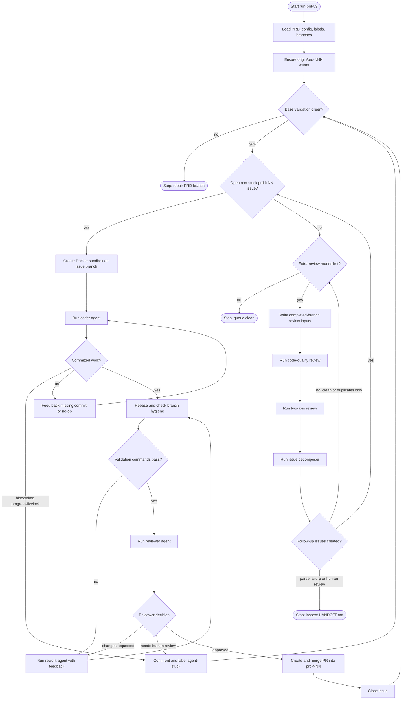

# Sandcastle Loop PRD Runner

This repository contains `run-prd-v3.mts`, an autonomous PRD implementation
loop built on `@ai-hero/sandcastle`. It reads a PRD, works through GitHub issues
for that PRD in isolated Docker sandboxes, validates and reviews each issue
branch, merges approved work into a PRD branch, then runs bounded PRD-level
extra review rounds to create and drain follow-up issues.

`run-prd-v3.mts` is the current runner variant. It includes the custom opencode
agent flow, shared cache mounts, PRD-level extra reviews, and a livelock watchdog
for coder/rework agent runs.

## What It Does

For PRD number `N`, the runner uses:

- PRD file: `docs/prd/<NNN>-*.md`
- PRD label: `prd-<NNN>`
- PRD integration branch: `prd-<NNN>`
- Issue branches: `prd-<NNN>-issue-<issue-number>`
- Stuck label: `agent-stuck`
- Extra-review follow-up label: `ai-review-followup`

The normal issue loop:

1. Finds the lowest-numbered open GitHub issue labelled `prd-<NNN>` that is not
   labelled `agent-stuck`.
2. Creates or reuses a Sandcastle Docker sandbox on an issue branch forked from
   `origin/prd-<NNN>`.
3. Runs a custom opencode `coder` agent for first-pass implementation.
4. Runs configured host validation commands.
5. Runs a read-only custom opencode `reviewer` agent over the issue diff.
6. If review requests changes, feeds the findings into a custom opencode
   `rework` agent on the next round.
7. If review approves, creates and merges a GitHub PR into `prd-<NNN>` and
   closes the issue.
8. If the loop cannot make progress, marks the issue with `agent-stuck` and
   leaves a diagnostic comment.

After the normal issue queue drains, the extra-review loop:

1. Compares the completed PRD branch to the required `--review-base` commit.
2. Runs independent read-only extra-review sessions:
   `code-quality`, `two-axis`, and `decomposer`.
3. Publishes decomposed findings as new `prd-<NNN>` issues labelled
   `ai-review-followup`.
4. Returns to the normal issue loop to implement those follow-ups.
5. Stops after the configured extra-review round budget or on a terminal
   condition that needs human attention.



## How It Works

The runner is a Node ESM TypeScript script executed with `tsx`.

At startup it:

- Resolves the current git repo root.
- Loads optional configuration from `.sandcastle/config.mts`.
- Resolves `--prd <N>` into the PRD file, label, and branch.
- Verifies `--review-base <commit-ish>` resolves to a commit.
- Ensures `origin/prd-<NNN>` exists, creating it from current `HEAD` if needed.

During each issue iteration it:

- Fetches and validates the PRD base branch before picking work.
- Uses Sandcastle's Docker sandbox provider.
- Mounts host opencode config/state into each sandbox:
  `~/.config/opencode` read-only and `~/.local/share/opencode` writable.
- Writes per-worktree custom opencode agent definitions under
  `.opencode/agents`.
- Keeps `.opencode/` out of git status through the worktree's local git exclude.
- Rejects oversized review prompts and overly large issue diffs before invoking
  agents.
- Rebases issue branches onto the latest `origin/prd-<NNN>` before validation.
- Attempts limited recovery for stale, polluted, or diverged issue branches.
- Records agent, validation, and issue outcome metrics to
  `.sandcastle/metrics/runs.jsonl`.

The v3 livelock guard watches coder and rework agent tool-call streams. If an
agent repeats the same tool call five times while the worktree snapshot does not
change, the run is aborted with a structured `agent_invocation_livelock` reason.
A round-1 coder livelock is converted into feedback and escalated to rework.
A rework livelock marks the issue stuck.

Extra-review artifacts are written under:

```text
.sandcastle/extra-review-runs/
  prd-<NNN>-.../
    round-<NN>-head-<sha>/
      review-input.diff
      review-input.diff-stat.txt
      review-input.changed-files.txt
      review-input.prd.md
      review-input.metadata.json
      code-review.raw.txt
      code-review.parsed.json
      two-axis-review.raw.txt
      two-axis-review.parsed.json
      issue-decomposer.raw.txt
      issue-decomposer.parsed.json
      created-issues.json
      skipped-duplicate-issues.json
      HANDOFF.md
```

## Requirements

Host requirements:

- Node.js with `npx`/`tsx` available.
- `@ai-hero/sandcastle` installed in the target repo.
- Docker Desktop or a running Docker daemon.
- Git, with a remote named `origin`.
- GitHub CLI `gh`, authenticated for the target repo.
- Git credentials that can push branches to `origin`.
- opencode installed and authenticated for the configured models.
- A clean tracked worktree on branch `prd-<NNN>` before starting the loop.

Repository requirements:

- Exactly one PRD file matching `docs/prd/<NNN>-*.md`.
- GitHub issues labelled `prd-<NNN>` for the work to implement.
- Prompt files and support modules available at the paths used by
  `run-prd-v3.mts`.
- Validation commands that can run from the host worktree.
- Setup commands that can run inside a fresh sandbox worktree.

Default validation commands are:

```bash
npm run typecheck
npm run test
npm run build
```

Default sandbox setup command:

```bash
npm install
```

Override these in `.sandcastle/config.mts` for repos that use another package
manager or test/build layout.

## Setup

1. Install Sandcastle in the target repo:

```bash
npm install --save-dev @ai-hero/sandcastle
npx sandcastle init
```

2. Put the runner, support modules, and prompt files where the runner can import
   them. The common layout is to keep them in `.sandcastle/` at the repo root.
   If `run-prd-v3.mts` lives at the repo root instead, keep the support modules
   beside it and keep prompt/config files under `.sandcastle/`.

   Minimum runtime file set for the v3 runner:

```text
.sandcastle/
  run-prd-v3.mts
  sandcastle-loop-config.mts
  agent-invocation-livelock.mts
  custom-agent-argv-guard.mts
  custom-agent-defs.mts
  custom-agent-render.mts
  custom-agent-worktree.mts
  extra-review-artifacts.mts
  extra-review-config.mts
  extra-review-contracts.mts
  extra-review-inputs.mts
  extra-review-issues.mts
  extra-review-main-loop.mts
  extra-review-parser-utils.mts
  extra-review-parsers.mts
  extra-review-queue-state.mts
  extra-review-sessions.mts
  extra-review-support.mts
  loop-progress.mts
  mark-stuck-comment.mts
  metrics-recorder.mts

  coder-agent-system-prompt-prd.md
  coder-user-prompt-prd.md
  rework-agent-system-prompt-prd.md
  rework-user-prompt-prd.md
  reviewer-agent-system-prompt-prd.md
  reviewer-user-prompt-prd.md
  code-quality-agent-system-prompt-prd.md
  code-quality-user-prompt-prd.md
  two-axis-agent-system-prompt-prd.md
  two-axis-user-prompt-prd.md
  decomposer-agent-system-prompt-prd.md
  decomposer-user-prompt-prd.md
```

3. Ensure opencode is configured on the host. The runner bind-mounts:

```text
~/.config/opencode        -> ~/.config/opencode        read-only
~/.local/share/opencode   -> ~/.local/share/opencode   writable
```

4. Create the PRD file:

```text
docs/prd/003-example-feature.md
```

5. Create GitHub issues for the PRD and label them:

```bash
gh label create prd-003 --color 5319e7 --description "PRD 003 work"
gh issue edit <issue-number> --add-label prd-003
```

6. Check out the PRD branch and keep tracked files clean:

```bash
git switch -c prd-003
git push -u origin prd-003
git status --short --untracked-files=no
```

7. Choose the review base. This should be the fixed commit the PRD branch should
   be compared against during extra-review rounds, commonly `main` or a
   merge-base SHA.

## Running

From the repo root:

```bash
npx tsx .sandcastle/run-prd-v3.mts --prd 3 --review-base main
```

If the script is at the repo root:

```bash
npx tsx run-prd-v3.mts --prd 3 --review-base main
```

CLI flags:

- `--prd <N>`: required positive integer. `3` resolves to `003`.
- `--review-base <commit-ish>`: required commit, branch, or tag used for
  PRD-level extra-review diffs.
- `--idle-timeout <seconds>`: optional. Defaults to `1800` seconds. Increase it
  for slow local models that buffer output for long periods.

Example with a longer timeout:

```bash
npx tsx .sandcastle/run-prd-v3.mts \
  --prd 3 \
  --review-base main \
  --idle-timeout 3600
```

## Example `.sandcastle/config.mts`

```ts
import type { SandcastleLoopConfig } from "./sandcastle-loop-config.mts";

const config: SandcastleLoopConfig = {
  models: {
    coder: "strix/qwen3.6-35b-a3b-8bit",
    rework: "anthropic/claude-sonnet-4-5",
    reviewer: "zai-coding-plan/glm-5.1",
    codeQuality: "zai-coding-plan/glm-5.1",
    twoAxis: "zai-coding-plan/glm-5.1",
    issueDecomposer: "zai-coding-plan/glm-5.1",
    escalationReview: "anthropic/claude-sonnet-4-5",
  },

  setupCommands: [
    "npm ci",
  ],

  validationCommands: [
    "npm run typecheck",
    "npm run test",
    "npm run build",
  ],

  cache: {
    root: "~/.cache/sandcastle-loop",
    mounts: [
      {
        name: "npm",
        sandboxPath: "~/.npm",
      },
      {
        name: "vite",
        sandboxPath: "node_modules/.vite",
      },
    ],
    env: {
      npm_config_cache: "~/.npm",
    },
  },
};

export default config;
```

Config notes:

- The file must default-export an object.
- All fields are optional; missing fields use built-in defaults.
- `models` is a partial role-to-model map.
- `setupCommands` run inside each sandbox after the worktree is ready.
- `validationCommands` run on the host against the candidate worktree.
- `cache.root` is a host path. `~` expands to the host home directory.
- Each cache mount creates a host directory and bind-mounts it into the sandbox.
- `cache.env` values are expanded for sandbox commands and translated to host
  paths for host-side validation when they point inside a configured mount.

## Stop Conditions

The loop stops when one of these conditions occurs:

- No eligible PRD issues remain and the extra-review budget is exhausted.
- An issue is marked stuck.
- The PRD base branch fails validation.
- Extra-review output fails parsing or requests human review.
- The outer iteration cap is reached.
- A sandbox, agent, git, or GitHub operation crashes unexpectedly.

On stop, check console output and the latest `HANDOFF.md` under
`.sandcastle/extra-review-runs/` when present.
