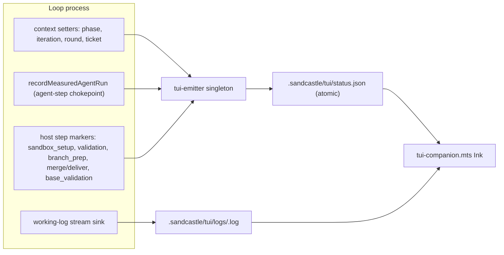

# Companion TUI for the Sandcastle loops — Implementation Plan

> **For agentic workers:** Implement this plan task-by-task. Steps use checkbox (`- [ ]`)
> syntax for tracking. Each task ends green (typecheck + tests) before moving on.
> Implement TDD where a test step is given.

**Goal:** Add a read-only **Companion TUI** that renders a loop's live state in a second
terminal, per [docs/prd/004-companion-tui.md](../prd/004-companion-tui.md). The loop is the
source of truth: it writes an atomic **status snapshot** (`.sandcastle/tui/status.json`) at
every step transition and a per-agent-step **working log**; the TUI only reads these. Only
`run-prd-v4.mts` and `run-backlog-v2.mts` are instrumented.

**Architecture:** A side-effect-only **emitter singleton** (`tui-emitter.mts`) holds
loop-level context (identity, phase, iteration/round counters, ticket) that the loops set at
coarse points, and writes the snapshot atomically plus the working log. Emission is gated on
`startLoop()` so other runners that import the shared chokepoint are unaffected, and every
write is wrapped so a failure can never propagate into loop control flow. Three pure modules
back it: `tui-status.mts` (contract + builder + atomic writer + path helpers),
`tui-working-log.mts` (stream-event → lines formatter), and `tui-view.mts` (status-view +
working-log-target derivation). The TUI (`tui-companion.mts`) is a strictly read-only Ink
renderer driven by the two pure `tui-view` functions.

**Key reuse that keeps the change small:** both loops already funnel every agent run through
`recordMeasuredAgentRun` ([metrics-recorder.mts](../../metrics-recorder.mts)), and coder/rework
already stream events through `createLivelockWatchdogStreamCallback`
([agent-invocation-livelock.mts](../../agent-invocation-livelock.mts)). Agent-step *status*
hooks `recordMeasuredAgentRun`; working-log *content* hooks the stream callback. Only reviewer
and the extra-review sessions need a working-log sink + explicit path added.

**Tech Stack:** TypeScript `.mts` (Node ESM), `@ai-hero/sandcastle` (type-only in shared
modules), `node:test` + `node:assert/strict`, `node:fs` (atomic `renameSync`), Ink + React
(TUI only), `tsx` on the host. Pure/emitter suites run locally with `node --test <file>`
(Node's native type-stripping); the host runs `npm run typecheck && npm run test`.

> **Baseline note:** this context repo has no `package.json`/`node_modules`; the runtime file
> set is copied to the host (e.g. `~/lawncare-saas`) where Sandcastle, Ink, and React are
> installed. `forgejo-tea.test.mts` fails under `node --test` locally (a TS parameter property
> needs `tsx`) — that is pre-existing and unrelated. New modules avoid TS-only syntax so they
> strip cleanly.

---

## Design decisions

- **Loop is the source of truth; TUI is strictly read-only.** No stdout parsing. (ADR 0002)
- **One snapshot, written atomically** (temp file + `renameSync`) at every step transition.
  A reader never sees a partial write. (ADR 0002)
- **One working log per agent step**, loop-owned and loop-formatted from the Sandcastle
  stream events the loop already intercepts. (ADR 0003)
- **Emitter gated + swallowing.** Nothing is written until `startLoop()`; every write is
  wrapped so a failure is swallowed and never reaches loop control flow.
- **Heartbeat.** The emitter refreshes `updatedAt` on a short unref'd interval so a long
  agent step still looks alive; `stop()` clears it. Liveness combines this heartbeat with a
  `pid` probe the TUI performs.
- **Escalation tier not emitted.** Neither instrumented runner uses it; `phase:"escalation"`
  and `step.name:"escalation_review"` stay in the type for future runners.
- **Pure derivation.** `deriveStatusView` and `deriveWorkingLogTarget` hold all liveness,
  elapsed-freeze, counter-formatting, and clear-vs-continue-vs-freeze logic so they are
  tested without Ink or `fs.watch`.

---

## File structure

**Create (shared, pure + emitter):**
- `tui-status.mts` — `TuiStatus` contract, `buildTuiStatus`, `writeStatusSnapshotAtomic`, path helpers.
- `tui-working-log.mts` — pure `formatWorkingLogLines`.
- `tui-view.mts` — pure `deriveStatusView` + `deriveWorkingLogTarget`.
- `tui-emitter.mts` — side-effect-only singleton `tuiEmitter`.
- `tui-status.test.mts`, `tui-working-log.test.mts`, `tui-view.test.mts`, `tui-emitter.test.mts`.

**Create (TUI + packaging):**
- `package.json` — declares `ink`, `react` (deps), `tsx`, `@types/react` (devDeps); `tui` + `test` scripts.
- `tui-companion.mts` — the Ink app.

**Modify (shared, additive):**
- `metrics-recorder.mts` — optional `activeLogPath`; call `tuiEmitter.beginAgentStep` at the chokepoint; injectable emitter dep.
- `agent-invocation-livelock.mts` — forward optional `onStreamEvent` through `createLivelockWatchdogSandcastleRunOptions`.
- `extra-review-sessions.mts` — thread an optional working-log hook into `runSession`.
- `metrics-recorder.test.mts` — chokepoint-fires-once test.

**Modify (loop instrumentation):**
- `run-prd-v4.mts`, `run-backlog-v2.mts`.

**Docs:** `README.md` — Companion TUI section.

---

## Task 1: Status contract, builder, atomic writer, path helpers

**Files:** Create `tui-status.mts`; Create `tui-status.test.mts`.

- [ ] **Step 1: Write the test** (`tui-status.test.mts`): `buildTuiStatus` copies context +
  step and stamps `updatedAt` from `now`; optional fields are omitted when absent; and
  `writeStatusSnapshotAtomic(dir, status)` produces a complete, `JSON.parse`-able
  `status.json` in a `node:os` tmp dir (reader never sees a partial file).
- [ ] **Step 2: Implement `tui-status.mts`**: export the `TuiStatus` type (exact PRD shape,
  `schemaVersion: 1`), `TuiStatusContext`, `TuiStep`, counters/ticket types; `buildTuiStatus`;
  `writeStatusSnapshotAtomic` (write `status.json.tmp-*`, then `renameSync`); and
  `tuiDir(cwd?)`, `tuiStatusPath(cwd?)`, `tuiWorkingLogPath(runName, cwd?)` (sanitizes runName).
- [ ] **Step 3: Gate** — `node --test tui-status.test.mts` PASS; host `npm run typecheck` PASS.

## Task 2: Working-log line formatter

**Files:** Create `tui-working-log.mts`; Create `tui-working-log.test.mts`.

- [ ] **Step 1: Write the test**, mirroring `toolCallObservationFromStreamEvent` tests: a
  `toolCall` event → `["→ name(formattedArgs)"]`; a text event → its non-empty lines; malformed
  / ignored events → `[]`.
- [ ] **Step 2: Implement `formatWorkingLogLines(event): string[]`** — pure, defensive, no throw.
- [ ] **Step 3: Gate** — `node --test tui-working-log.test.mts` PASS; host `npm run typecheck` PASS.

## Task 3: Status-view + working-log-target derivation

**Files:** Create `tui-view.mts`; Create `tui-view.test.mts`.

- [ ] **Step 1: Write the test**: `deriveStatusView(status, now, opts)` — liveness
  `running | stale | dead | stopped` from `loopState`, `opts.pidAlive`, and heartbeat age vs
  thresholds; elapsed frozen (at `updatedAt − startedAt`) unless running; formatted
  phase / `N/max` / `R/max` / `K/max` / ticket. `deriveWorkingLogTarget(prev, next)` —
  `clear` (new agent step / retarget), `continue` (same agent step), `freeze` (host step).
- [ ] **Step 2: Implement `tui-view.mts`** (both pure functions + formatting helpers).
- [ ] **Step 3: Gate** — `node --test tui-view.test.mts` PASS; host `npm run typecheck` PASS.

## Task 4: The emitter singleton

**Files:** Create `tui-emitter.mts`; Create `tui-emitter.test.mts`.

- [ ] **Step 1: Write the test** (inject `cwd` + a throwing `writeSnapshot`): before
  `startLoop`, all methods are no-ops (no file written); after `startLoop`, `beginAgentStep`
  writes a snapshot and truncates a fresh working log; a write that throws is swallowed
  (method never throws); `stop(reason)` writes `loopState:"stopped"` with the reason.
- [ ] **Step 2: Implement `tui-emitter.mts`**: `TuiEmitter` class + `tuiEmitter` singleton with
  `startLoop`, `setPhase`, `setIteration`, `setRound`, `setExtraReviewRound`, `setTicket`,
  `clearTicket`, `beginHostStep`, `beginAgentStep`, `workingLogSink`, `stop`; a `safe()` wrapper
  around every fs write; an unref'd heartbeat interval started on `startLoop` and cleared on
  `stop`. Constructor accepts injectable `{ cwd, writeSnapshot, truncateLog, appendLog, now,
  heartbeatIntervalMs }` for tests. No TS parameter properties (keep it strip-safe).
- [ ] **Step 3: Gate** — `node --test tui-emitter.test.mts` PASS; host `npm run typecheck` PASS.

## Task 5: Hook the agent-step chokepoint

**Files:** Modify `metrics-recorder.mts`; Modify `metrics-recorder.test.mts`.

- [ ] **Step 1:** Add optional `activeLogPath?: string` to `MeasuredAgentRunMetadata`.
- [ ] **Step 2:** Add an optional third arg to `recordMeasuredAgentRun` —
  `deps: { beginAgentStep?: (input) => void } = {}` — defaulting to `tuiEmitter.beginAgentStep`;
  call it once at the start (before `run()`) with `{ stage, agent, model, worktreePath,
  activeLogPath }`. Existing 2-arg call sites are unaffected.
- [ ] **Step 3: Test:** extend `metrics-recorder.test.mts` — a synthetic run with an injected
  `beginAgentStep` spy fires exactly once (both success and thrown-error paths), without a
  real sandbox.
- [ ] **Step 4: Gate** — `node --test metrics-recorder.test.mts` PASS; host `npm run typecheck` PASS.

## Task 6: Forward a working-log sink through the livelock options

**Files:** Modify `agent-invocation-livelock.mts` (verify `agent-invocation-livelock.test.mts` still green under `tsx`).

- [ ] **Step 1:** Add optional `onStreamEvent?: (event: unknown) => void` to the input of
  `createLivelockWatchdogSandcastleRunOptions` and forward it into
  `createLivelockWatchdogStreamCallback` (which already forwards to `options.onStreamEvent`).
- [ ] **Step 2: Gate** — host `npm run typecheck && npm run test` PASS (existing livelock tests unchanged).

## Task 7: Thread a working-log hook into extra-review sessions

**Files:** Modify `extra-review-sessions.mts` (keep `extra-review-sessions.test.mts` green).

- [ ] **Step 1:** Add optional `logging?: unknown` to `ExtraReviewSandboxRunInput`.
- [ ] **Step 2:** Add optional `onAgentSession?: (info: { session, runName, worktreePath }) =>
  { activeLogPath?: string; logging?: unknown } | undefined` to
  `RunSequentialExtraReviewSessionsInput`, thread it through the three `runXxx` wrappers into
  `runSession`, set `activeLogPath` in the `recordMeasuredAgentRun` metadata, and pass
  `logging` into `sandbox.run`. Default undefined keeps existing tests unchanged.
- [ ] **Step 3: Gate** — host `npm run typecheck && npm run test` PASS.

## Task 8: The Ink Companion TUI + packaging

**Files:** Create `package.json`; Create `tui-companion.mts`.

- [ ] **Step 1:** `package.json` — `dependencies`: `ink`, `react`; `devDependencies`: `tsx`,
  `@types/react`; scripts `"tui": "tsx tui-companion.mts"`, `"test": "tsx --test *.test.mts"`.
- [ ] **Step 2:** `tui-companion.mts` — left status pane (~40%, min width) from
  `deriveStatusView`; right working-log pane tailing the `deriveWorkingLogTarget` file (freeze
  + thin footer during host steps); keybindings footer; hybrid refresh (`fs.watch` on
  `.sandcastle/tui` + active log, ~1s poll fallback, ~1s tick); waiting / running / stopped /
  dead states; scrollback; quit on `q`; never writes to or signals the loop.
- [ ] **Step 3: Gate** — host `npm run typecheck` PASS; `node --test *.test.mts` still green
  (excluding the pre-existing `forgejo-tea` local-strip failure).

## Task 9: Instrument `run-prd-v4.mts`

- [ ] `startLoop({ loopType:"prd", loopId, pid, loopStartedAt })` after startup logging.
- [ ] `setPhase("normal_issue")` + `setIteration` per outer iteration; `setTicket` after issue
  pick; `setRound` in the review-round loop; `clearTicket` when the issue finishes.
- [ ] Host steps: `sandbox_setup` (createSandbox), `validation` (per command in the gate),
  `branch_prep` (prepare/rebase), `base_validation` (base green check), `merge` (approve+merge).
- [ ] Agent steps: set `activeLogPath: tuiWorkingLogPath(runName)` on the coder/rework/reviewer
  `recordMeasuredAgentRun` metadata; pass `onStreamEvent: tuiEmitter.workingLogSink(activeLogPath)`
  into the coder/rework livelock options; add reviewer `logging` with `onAgentStreamEvent` sink
  (keeping a native log path so `acquireReviewerResult` still resolves `logFilePath`).
- [ ] Extra review: `setPhase("extra_review")` + `setExtraReviewRound`; pass the `onAgentSession`
  working-log hook into `runSequentialExtraReviewSessions`.
- [ ] `tuiEmitter.stop(reason)` at clean shutdown.
- [ ] **Gate** — host `npm run typecheck` PASS; `node --test *.test.mts` green.

## Task 10: Instrument `run-backlog-v2.mts`

- [ ] `startLoop({ loopType:"backlog", loopId, ... })`; phase is always `normal_issue`.
- [ ] `setIteration` in the main loop; `setTicket`/`setRound`/`clearTicket` per issue/round.
- [ ] Host steps: `sandbox_setup`, `branch_prep` (rebase + prepare-for-review), `validation`
  (per command), `deliver_review_ready`.
- [ ] Agent steps wired identically to v4 (coder/rework via livelock sink; reviewer logging).
- [ ] `tuiEmitter.stop(stopReason)` at clean shutdown.
- [ ] **Gate** — host `npm run typecheck` PASS; `node --test *.test.mts` green.

## Task 11: README + final gate

- [ ] Add a **Companion TUI** section to `README.md`: install `ink`/`react` on the host, run
  `npm run tui` (or `npx tsx tui-companion.mts`) in a second terminal, the read-only guarantee,
  the `.sandcastle/tui/` artifacts, and waiting/running/stopped/dead states. Add the new module
  files to the runtime file set.
- [ ] **Final gate** — host `npm run typecheck && npm run test && npm run build`; locally
  `node --test *.test.mts` (only the pre-existing `forgejo-tea` strip failure remains).

---

## Self-review checklist (run before handoff)

- **Spec coverage:** snapshot contract + atomic write (Task 1), working-log format (Task 2),
  pure derivation (Task 3), gated swallowing emitter + heartbeat (Task 4), single agent-step
  chokepoint (Task 5), coder/rework + reviewer + extra-review working logs (Tasks 6–7, 9–10),
  Ink two-pane read-only TUI with hybrid refresh and liveness (Task 8), both loops instrumented
  (Tasks 9–10), docs (Task 11).
- **Type/name consistency:** `TuiStatus` is the single shared contract; `activeLogPath` flows
  `metadata → beginAgentStep → snapshot.step.activeLogPath → workingLogSink`; `tuiWorkingLogPath`
  is computed once per agent run and shared by metadata + sink.
- **Safety:** emission gated on `startLoop`; every fs write swallowed; TUI never writes/signals
  the loop; no loop control-flow changes beyond additive emitter calls and giving
  reviewer/extra-review a working-log path.
- **Risks:** confirm Sandcastle honors an explicit reviewer `logging.path` so
  `acquireReviewerResult` keeps resolving `logFilePath`; `runValidationGate` is per-runner so
  the `validation` marker is added in each file; new modules stay strip-safe (no parameter
  properties/enums/namespaces).
